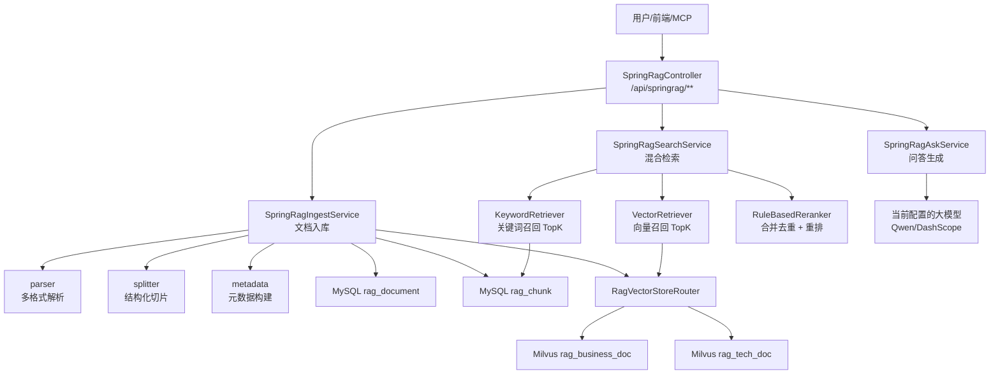
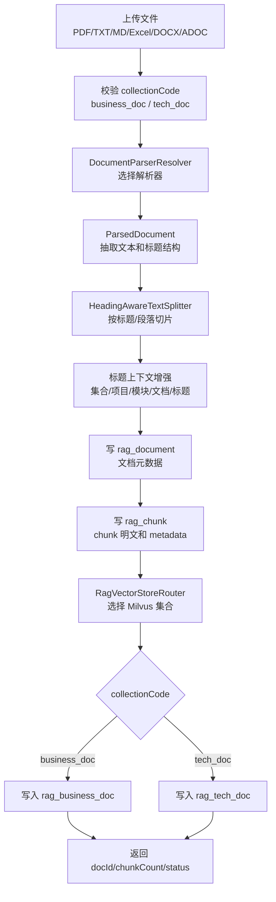
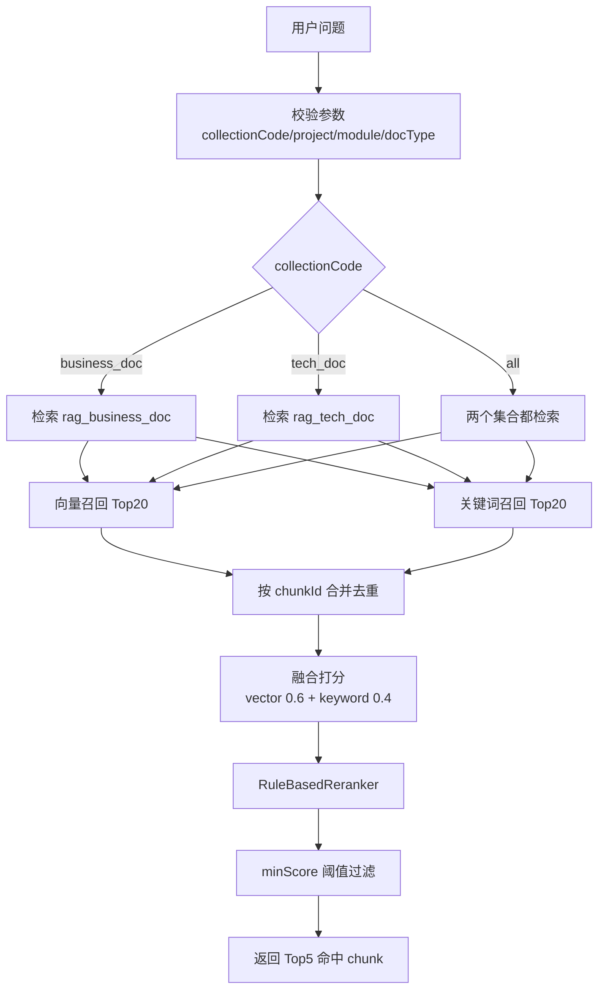
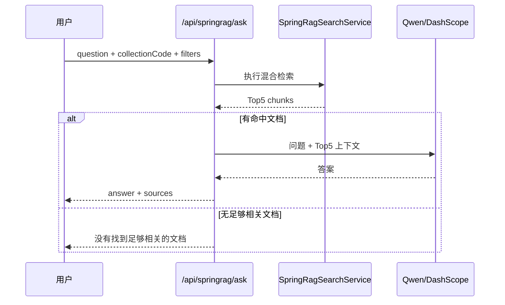
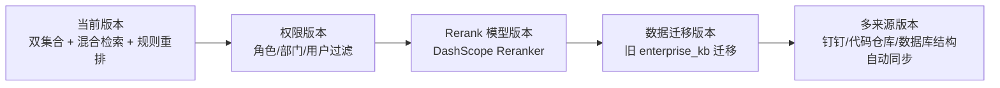

# 趣拿 RAG 工程化升级技术方案

## 1. 背景与目标

当前系统中的 `DocController / DocService / RagService` 仍偏 demo 形态，主要问题包括：

- 所有文档写入同一个向量集合，业务文档、技术文档混在一起。
- 文档切片按固定长度处理，缺少标题、项目、模块等上下文。
- 向量库只保存 `content/vector`，缺少可用于过滤和溯源的 metadata。
- 搜索只做向量召回，面对类名、接口路径、字段名、表名等问题时容易召回不相关内容。
- 没有 Rerank 和最低分阈值控制，TopK 后部结果容易污染最终回答。

本次升级目标是在 `com.quna.rag.springrag` 下建设独立的正式 RAG 链路，与旧 demo 解耦，并优先支持两个知识集合：

| 集合编码 | Milvus 集合 | 说明 |
| --- | --- | --- |
| `business_doc` | `rag_business_doc` | 业务文档、产品方案、流程说明 |
| `tech_doc` | `rag_tech_doc` | 技术文档、接口文档、代码规范、数据库说明 |

权限控制本版本仅预留字段，所有文档默认可见，后续可扩展为按角色、部门或用户过滤。

## 2. 总体架构



核心原则：

- 旧接口保留：`/api/doc/**`、`/api/rag/**` 不删除，避免影响现有功能。
- 新接口独立：正式能力统一通过 `/api/springrag/**` 暴露。
- 集合拆分：技术文档与业务文档写入不同 Milvus collection。
- 双路召回：向量检索负责语义，关键词检索负责专有名词和精确匹配。
- 重排过滤：召回后统一去重、打分、过滤，再进入问答生成。

## 3. 包结构

```text
com.quna.rag.springrag
├─ controller       对外接口
├─ model            DTO、实体、集合枚举、命中结果
├─ parser           PDF/TXT/MD/Excel/DOCX/ADOC 解析
├─ splitter         结构化切片、标题上下文增强
├─ metadata         metadata 构建
├─ store            MySQL Mapper、Milvus 双集合路由
├─ retrieval        向量召回、关键词召回、混合召回
├─ rerank           Rerank 接口与规则重排实现
├─ service          入库、搜索、问答编排
├─ config           RAG 参数配置
└─ util             Hash 等工具
```

## 4. 文档入库设计

### 4.1 入库流程



### 4.2 支持格式

| 格式 | 解析方式 | 处理重点 |
| --- | --- | --- |
| PDF | PDFBox | 提取页面文本，去除异常控制字符 |
| TXT | UTF-8 文本读取 | 原文入库 |
| MD | Markdown 文本读取 | 按 `#` 标题切分 |
| ADOC | AsciiDoc 文本读取 | 按 `=` 标题切分 |
| DOCX | Apache POI | 段落 + 表格文本抽取 |
| XLS/XLSX | Apache POI | 按 Sheet 转 Markdown 表格 |

### 4.3 切片策略

技术文档：

```text
chunkSize = 700
chunkOverlap = 100
适合接口文档、类名、方法、数据库字段等较密集内容
```

业务文档：

```text
chunkSize = 1000
chunkOverlap = 100
适合业务流程、产品方案、长段落说明
```

每个 chunk 会自动增强上下文：

```text
集合：技术文档
项目：midst-zscms
模块：activity
文档：SpecialDiscount接口文档.md
标题：保存接口

正文：
...
```

这样可以避免 chunk 内容只有“请求参数：id、name、status”时，向量模型无法判断它属于哪个接口或模块。

## 5. 数据模型

### 5.1 `rag_document`

保存文档级元数据。

| 字段 | 说明 |
| --- | --- |
| `id` | 文档 ID |
| `collection_code` | `business_doc` 或 `tech_doc` |
| `filename` | 文件名 |
| `file_type` | 文件类型 |
| `source` | 来源，本版本为 `UPLOAD` |
| `project` | 项目 |
| `module` | 模块 |
| `doc_type` | 文档类型，如 `api_doc`、`design_doc` |
| `tags` | 标签 |
| `permission_scope` | 权限范围，当前默认 `ALL` |
| `visible_roles` | 可见角色，当前预留 |
| `status` | `INDEXING` / `INDEXED` |
| `chunk_count` | chunk 数量 |
| `content_hash` | 文档内容 hash |

### 5.2 `rag_chunk`

保存 chunk 明文，支持关键词检索和命中溯源。

| 字段 | 说明 |
| --- | --- |
| `id` | chunk ID |
| `doc_id` | 文档 ID |
| `collection_code` | 所属集合 |
| `chunk_index` | chunk 序号 |
| `title_path` | 标题路径 |
| `content` | chunk 内容 |
| `content_hash` | chunk hash |
| `keywords` | 简单关键词冗余 |
| `metadata_json` | Milvus metadata 同步副本 |

## 6. 检索设计

### 6.1 检索流程



### 6.2 向量召回

使用 Spring AI `VectorStore` 对接 Milvus：

```text
business_doc -> rag_business_doc
tech_doc     -> rag_tech_doc
```

默认：

```text
vectorTopK = 20
similarityThresholdAll
```

过滤条件：

```text
project
module
docType
```

本版本不加权限过滤。

### 6.3 关键词召回

关键词检索走 MySQL `rag_chunk`：

```text
FULLTEXT(content) Top20
```

如果 FULLTEXT 因分词或数据库配置异常失败，自动降级：

```text
LIKE %query%
```

这保证技术类问题中的类名、接口路径、字段名、表名不会完全依赖向量语义。

### 6.4 合并去重

去重键：

```text
collectionCode + chunkId
```

融合得分：

```text
score = vectorScore * 0.6 + keywordScore * 0.4
```

如果同一个 chunk 同时被向量和关键词召回，则额外加分。

### 6.5 Rerank

第一版实现 `RuleBasedReranker`，不依赖外部 rerank 模型。

加分规则：

- 问题中的类名、接口路径、表名、字段名命中标题。
- 问题关键词命中正文。
- `project` 精确匹配。
- `module` 精确匹配。
- `docType` 精确匹配。
- 同时被向量和关键词召回。

默认输出：

```text
rerankTopK = 5
minScore = 0.65
```

后续可以新增 `DashScopeReranker`，不影响现有接口。

## 7. 问答设计



回答规则：

- 只依据检索资料回答。
- 资料不足时明确说明没有足够依据。
- 可返回 sources，便于前端展示引用来源。

## 8. 接口设计

### 8.1 上传文档

```text
POST /api/springrag/doc/upload
Content-Type: multipart/form-data
```

参数：

| 参数 | 必填 | 说明 |
| --- | --- | --- |
| `file` | 是 | 上传文件 |
| `collectionCode` | 是 | `business_doc` / `tech_doc` |
| `project` | 否 | 项目 |
| `module` | 否 | 模块 |
| `docType` | 否 | 文档类型 |
| `tags` | 否 | 标签 |

返回：

```json
{
  "code": 200,
  "data": {
    "docId": 1,
    "collectionCode": "tech_doc",
    "chunkCount": 18,
    "status": "INDEXED"
  }
}
```

### 8.2 文档列表

```text
GET /api/springrag/doc/list
```

查询参数：

```text
collectionCode
project
module
docType
```

### 8.3 混合检索

```text
POST /api/springrag/search
```

请求：

```json
{
  "question": "SpecialDiscount 保存接口怎么写？",
  "collectionCode": "tech_doc",
  "project": "midst-zscms",
  "module": "activity",
  "docType": "api_doc",
  "vectorTopK": 20,
  "keywordTopK": 20,
  "rerankTopK": 5,
  "minScore": 0.65
}
```

返回：

```json
{
  "code": 200,
  "data": {
    "question": "SpecialDiscount 保存接口怎么写？",
    "totalCandidates": 31,
    "total": 5,
    "hits": [
      {
        "chunkId": 10,
        "docId": 1,
        "collectionCode": "tech_doc",
        "filename": "SpecialDiscount接口文档.md",
        "titlePath": "保存接口",
        "score": 0.87,
        "vectorHit": true,
        "keywordHit": true,
        "content": "..."
      }
    ]
  }
}
```

### 8.4 RAG 问答

```text
POST /api/springrag/ask
```

请求参数同 search，额外支持：

```json
{
  "includeSources": true
}
```

返回：

```json
{
  "code": 200,
  "data": {
    "question": "...",
    "answer": "...",
    "sources": []
  }
}
```

## 9. 配置项

当前版本新增配置前缀：

```yaml
rag:
  springrag:
    vector-top-k: 20
    keyword-top-k: 20
    rerank-top-k: 5
    min-score: 0.65
    chunk:
      tech-size: 700
      business-size: 1000
      overlap: 100
      min-length: 80
    collections:
      business-doc: rag_business_doc
      tech-doc: rag_tech_doc
```

继续复用现有配置：

```yaml
milvus.host
milvus.port
milvus.dim
llm.api-key
llm.embedding-url
llm.embedding-model
```

## 10. 权限预留

本版本所有文档默认可见，不做权限过滤。

已预留字段：

```text
rag_document.permission_scope 默认 ALL
rag_document.visible_roles    预留角色列表
```

后续可扩展：

```text
搜索请求携带 currentUserRole
↓
检索时追加 visible_roles / permission_scope 过滤
↓
Milvus metadata filter + MySQL SQL 条件同步生效
```

## 11. 当前版本范围

已实现：

- 两个集合：`business_doc`、`tech_doc`
- 手动上传文档
- 多格式解析
- 结构化切片
- 标题上下文增强
- MySQL 文档元数据和 chunk 明文入库
- Milvus 双集合写入
- 向量 TopK + 关键词 TopK 混合召回
- 合并去重
- 规则 Rerank Top5
- `/api/springrag/doc/upload`
- `/api/springrag/doc/list`
- `/api/springrag/search`
- `/api/springrag/ask`

暂不实现：

- 不做角色权限控制
- 不迁移旧 demo 数据
- 不删除旧 `DocController`
- 不做钉钉文档同步迁移
- 不接外部 rerank 模型

## 12. 后续演进



建议优先级：

1. 用真实技术文档和业务文档分别上传验证召回效果。
2. 调整 `chunkSize / minScore / rerankTopK`。
3. 接入前端页面。
4. 再做权限控制和钉钉同步迁移。

